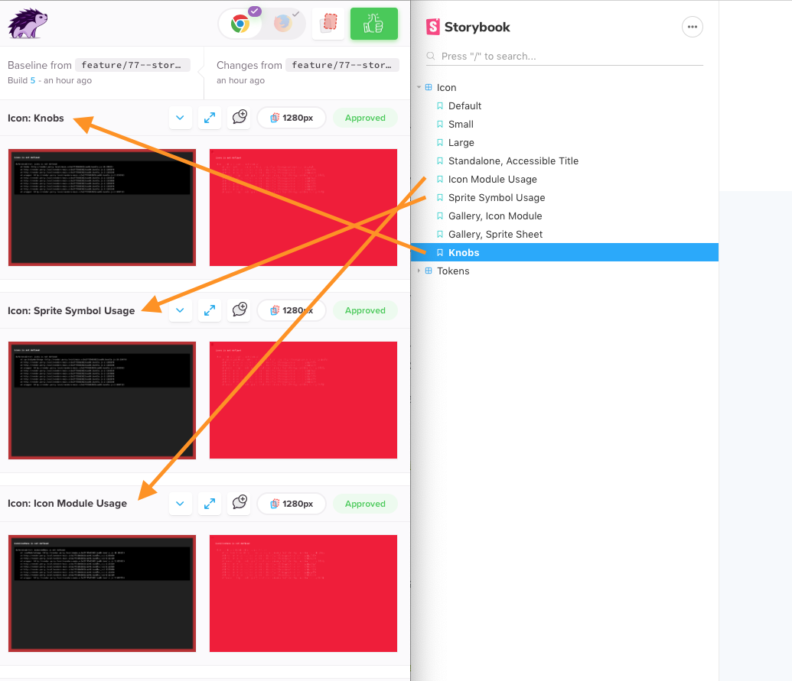

# ESDS Storybook

## Running the storybook environment
From this directory:

```bash
npm start
```

This will run the storybook environment _by itself_. Changes made to component, icon, or token source code will not be hot-reloaded. To work on a component's source in a hot-reloading environment see the [component dev environment documentation](../../components/README.md).

## VRT
`npm test`

Tests are executed using [Percy](https://percy.io). Notifications will be posted to the EightShapes design system slack channel when test runs complete.

## Writing Tests
A test file will be automatically created by the New Component Generator (TBD)

### Format
Tests use the [Storybook Docs](https://github.com/storybookjs/storybook/tree/master/addons/docs) MDX format:

```html
import { Meta, Story, Preview } from '@storybook/addon-docs/blocks';
import { html } from 'lit-html';

import '@eightshapes/esds-icon'; // Import the Web Component

<Meta
  title="Icon"
  component='esds-icon'
/>

# Icon
## Installation

<pre>
npm install @eightshapes/esds-icon
</pre>

## Default
<Preview>
  <Story name="Default">
    {html`<esds-icon></esds-icon>`}
  </Story>
</Preview>


## Small
<Preview>
  <Story name="Small">
    {html`<esds-icon size="small"></esds-icon>`}
  </Story>
</Preview>
```

### What to Test
Create tests to exercise each aspect of the component:
* Props & all values
* Slots (named & default)
* Methods - if there's a visible change as a result of a method, call the method so the visible change is shown
* Events - if there's a visible change that can be triggered by an event, call the event so the visible change is shown
* Content resilience
  * Add too much content. Trigger text wrapping and intentionally break the layout.
  * Provide too little content. Does the component have a valid empty state?

### What VRT sees
Each `<Story>` will be sent to [Percy](https://percy.io) as an individual screenshot.



## Debugging VRT
If VRT reveals failures that are not visible when running the storybook dev environment, take these steps to view an exact copy of what's uploaded to VRT.

`npm run build-storybook`

This will create a compiled version of storybook at `./storybook-static`.
To view this compiled version in a browser:
```bash
cd storybook-static
python -m SimpleHTTPServer 8000
```
This will start a simple web server on port 8000. Navigate to [http://localhost:8000](http://localhost:8000) to view the compiled storybook instance.

Compare what you see in the browser to the results from VRT. If they match and a test is failing, inspect the browser console to look for errors that may only occur in the compiled version of storybook.

These debugging steps _may_ reveal discrepancies between the regular storybook dev environment and the static build used by VRT.

## Accessibility Testing
The [Storybook Accessibility Addon](https://github.com/storybookjs/storybook/tree/master/addons/a11y) is enabled for all stories in the project. If the accessibility pane is not visible, choose "Show Addons" from the Storybook menu.


The accessibility addon **will not** fix all accessibility issues. An additional, manual, accessibility review step is recommended.

---
## Dependencies
* [@babel/core](https://github.com/babel/babel/tree/master/packages/babel-core)  
Dependency of [Storybook Docs Addon](https://github.com/storybookjs/storybook/tree/master/addons/docs)

* [@storybook/addon-a11y](https://github.com/storybookjs/storybook/tree/master/addons/a11y)  
Adds automated accessibility testing to storybook stories

* [@storybook/addon-docs](https://github.com/storybookjs/storybook/tree/master/addons/docs)  
Allows stories to be written using a combination of markdown and JSX tags.

* [@storybook/addon-knobs](https://github.com/storybookjs/storybook/tree/master/addons/knobs)  
Allows dynamic editing of component props via the Storybook UI

* [@storybook/addon-viewport](https://github.com/storybookjs/storybook/tree/master/addons/viewport)  
Makes stories resizable and responsive based on common device viewports.

* [@storybook/web-components](https://github.com/storybookjs/storybook/tree/next/app/web-components)  
Allows lit-element based web components to execute in the Storybook environment

* [babel-loader](https://www.npmjs.com/package/babel-loader)  
Dependency of [Storybook Docs Addon](https://github.com/storybookjs/storybook/tree/master/addons/docs)

* [lit-html](https://lit-html.polymer-project.org)  
Used to author web-component Storybook stories.

* [react](https://www.npmjs.com/package/react)  
Dependency of [Storybook Docs Addon](https://github.com/storybookjs/storybook/tree/master/addons/docs)

* [react-is](https://www.npmjs.com/package/react-is)  
Dependency of [Storybook Docs Addon](https://github.com/storybookjs/storybook/tree/master/addons/docs)
